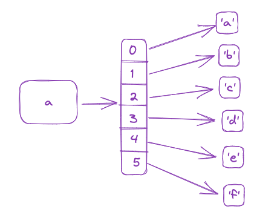
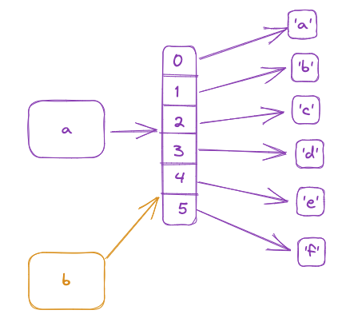
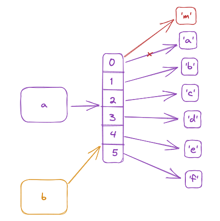
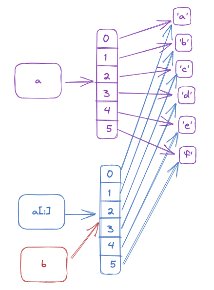
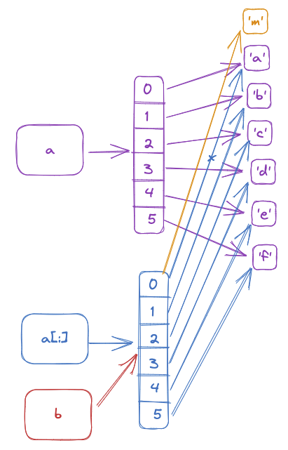
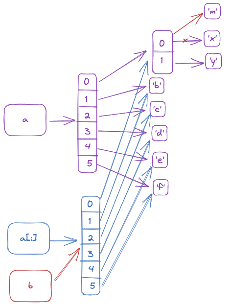
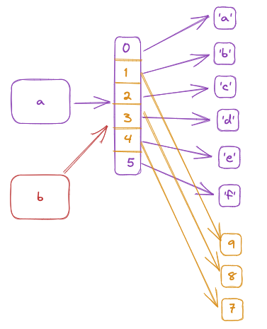

###字节数组和字符串

所有内存中的字符串和用户可见的字符,其的编码都是unicode码.unicode码所有字符由两个字节组成.

所有外设存储的内容并不是字符串而是字节数组bytes,即b’ABC’,字节组数其保存的是数字

**字节数组本质上是List[int8] , 数字的列表. 字符串是List[unicode] unicode的列表.**

> 字符串的长度是unicode的长度, 字节数组的长度是包含的字节数.

为了存储方便一般在传输和存储时,不存储unicode,而是以其它编码的形式,如utf-8,utf-16或gbk等.最广泛以及python默认的是utf-8.utf-8 通过1个字节存储英文字符,3个字节存储汉字等其它字符.

因此当把内容从文件读取进内存时,会尝试将list[int],通过utf-8 的规则转换为list[unicode],被称为utf-8解码decode.

把内存中数据写入硬盘,或者发送到网络上时,会将list[unicode]通过utf-8编码转换为list[int],被称为utf-8的编码encode.

Python是强类型语言,字符串与字节数组不能直接相互操作,要么bytes.decode()为string后操作,或者string.encode()之后和bytes一起操作.

> 字符串只有encode方法,字节数组bytes只有decode方法.字符串用于数据处理和显示,bytes用于数据的存储和传输.

**字符串用'abc'表示,, 字节数组用b'abc'表示.**

```python
#将str转换为bytes
>>> a='abc' #a是字符串,unicode编码
>>> a.encode()  # 方法1,通过str的encode函数.默认encode编码是utf-8,推荐
b'abc'  #返回类型是bytes
>>> bytes(a,encoding='utf-8') #方法2,通过bytes强制类型转换,但是必须显式指定encoding
b'abc'
#将bytes转换为str
>>> a=b'123' #a是字节数组
>>> a.decode() #方法1,通过bytes的decode函数,默认encode编码是utf-8,推荐
'123'  #将字节数组b'123' 转换为unicode编码的字符串'123'
>>> str(a,encoding='utf-8') #方法2,通过str强制类型转换,但是必须显示指定encoding
'123'
>>> list(a)
[49, 50, 51]
```

```
with open('data.bin', 'w') as f:
    f.write(b'\xf1\xf2\xf3\xf4\xf5') // 报错, 'w'模式是写string模式,不能直接写bytes
with open('data.bin', 'wb') as f:  // 正确,wb可以写bytes.
    f.write(b'\xf1\xf2\xf3\xf4\xf5')    
```

算术运算优先级: 括号,指数,乘除模,加减

###格式化输出

推荐使用f-string 格式化输出字符串.``print(f"Let's talk about {name}")`` ,简化输出. 其包含以下功能:

- {}内可以包含python表达式 , 如``print(f"Let's talk about {name.title()} and {i+1}")`` 
- {}内通过: 来区分变量和格式如`` f'{key:<10} = {value:.2f}'``,格式也可以包含变量如``print(f'My number is {number:.{places}f}')``

print 函数默认在行尾添加“\n”,print添加``end = ' '``参数则末尾不添加换行,而是以空格代替.

###多重赋值

Unpack argv如 ``script,first,second,third = argv``  其意思将argv[0] 赋值给script, argv[1]赋值给first.  **入参数量必须和解压后参数数量完全一致.**

> Argv[0]总是脚本名自身.

因此为了解决list太长,必须每个都赋值的场景, 可以使用 script,first,second,third,*others = argv 将剩余的list元素交给others列表. 或者是中间的元素:

```
numbers.sort()
min,*middle,max=numbers
```

将最小值和最大值赋值给max, 剩下的中间元素给middle列表.

Swap 如冒泡排序中的a[i-1], a[i] = a[i], a[i-1] # Swap , 右边本质上是一个tuple, 那么首先计算右边的值,然后创建tuple,然后赋值给左边.

像enumerate(list) 赋值给i,item和 dict.items()赋值给k,v都是多重赋值.

函数中的pack 和unpack:

函数定义时指定*args , 即将调用时的入参集合pack起来,打包到一个args参数中(tuple).

函数调用时指定*args,即将调用时的入参(tuple/list)解包unpack成单独的多个入参.

python中的入参和返回值,不论其返回多少个参数,其都是一个tuple. 因此多返回值的函数可以只赋值给一个变量,该变量就是一个tuple,可以通过unpack解压.

### 并行迭代zip

**当两个list他们的内容相关联,**而且需要同时迭代处理他们的内容时,可以使用zip(list1,list2)来创建一个()(item1,item2),…)的迭代器来进行迭代.

比如有一个名字列表, 有一个名字长度列表, 要求找出最长的名字,就可以zip(name,count)来得到想要的名字和count的对应关系,进而处理.

但是如果当列表的长度不一致时,默认zip迭代完短的就结束. 如果要迭代完长的才结束, 则需要使用:itertools.zip_longest(names, counts)

> 如果list1 中元素有重复,那么后面的key会覆盖前面的. 如a=[1,2,1],b=[3,4,5] 那么dict(zip(a,b)) ->  {1: 5, 2: 4} 其中 (1,3)被覆盖.

###List切片

所有的通过读创建切片操作都会创建一个新数据结构(新列表),这个新列表是原来列表的浅拷贝.

**但是当直接给切片赋值时,直接修改的是原始列表的数据结构**,可以修改原始列表的大小等.即当切片在等号右边时,是创建一个新列表数据结构,当切片在等号左边是,是对原有列表数据结构的修改.

给切片中的元素赋值时,只影响切片的元素,不影响原列表元素.

当指定``a = ['a', 'b', 'c', 'd', 'e', 'f'] ``时,其创建的数据结构如下:




b=a赋值 , 则a和b指向统一个列表. 修改列表的值如a[0]=‘m’ ,那么a和b都会被修改.

赋值后:



修改后 a[0]=‘m’  -> b[0] ==‘m’



**切片**

对a的切片是创了一个a的浅拷贝, b=a[:] :



那么对b[0] = ‘m’的修改,就不会影响到a列表中. b[0]=‘m’ 而 a[0]==‘a’



> 但是如果是2元list,即list内包含list.那么 ``b[0][0]=‘m’ -> a[0][1]==‘m’``, 因为b[0]和a[0]指向的数据结构没变.
>
> 

如果对切片赋值,则直接修改数据结构, b=a , a[1:4]=[9,8,7] ,那么a和b还是相等,等于[‘a’,9,8,7,’f’]



切片中可以包含参数, 这样可以根据参数动态进行切片: list[-n:]或list[n:]

对切片赋值可以改变原list的长度,如 list[2:7]=[1,2,3].

### 列表排序

list提供sort() 方法来对list进行排序. 如果对于list of dict ,也可以通过key来进行排序.

list也可以通过lambda函数来对对象进行排序. 

```
a= [Student1,Student2,Student3] // 三个对象
那么可以通过a.sort(key=lambda x:x.age) //对student对象的年龄排序
可以同构a.sort(key=lambda x:(x.age,x.name)) //对年龄和名字排序, 而且先排序年龄后排序名字.
a.sort(key=lambda x:(-x.age,x.name)) //先对年龄降序排列,然后根据名字升序排列. 
```

文件readline()函数读取的一行字符串是包含\n的.

遍历 list :  for i in list:

另一种遍历list的方式: for i in ``"abc","cde","efg":``  这样会自动将``"abc","cde","efg"``变为list后遍历.

遍历 dict: for k,v in dict.items():

复制list : a = b[:]

###Get遍历dict

在dict中查找一个不存在的key时,如果直接使用 dict['key_not_exist']则会报错KeyError.

```
try:
    count = dict[key]
except KeyError:
    count = 0
dict[key]=count+1
```

两种办法来检查key是否在dict种, 一种是通过if测试

```
if key in dict:
   count = dict[key] 
else
  count=0
dict[key]=count+1
```

另一种方式是使用value=dict.get("key") 

```
count=dict.get(key,0) //如果不存在,设置默认值为0
dict[key]=count+1
```

### 使用defaultdict初始化缺省值

一般情况下,对dict的赋值就是`dict[key]=value`,但是当value不是简单数据类型时,可能需要额外的操作.

比如想要**动态构建一个dict of dict 或者 dict of list时**,由于其value list和dict不是简单数据类型,需要做初始化.

一个复杂的版本是:

```
by_letter = {}
for word in words:
		letter = word[0]
		if letter in by_letter :
		    by_letter[letter].append(word)
		else:
		    by_letter[letter]=[] //初始化
		    by_letter[letter].append(word)
```

一个使用setdefault的简化版本:

```
by_letter = {}
for word in words:
		by_letter.setdefault(word[0], []).append(word) // 如果by_letter[letter]存在则对value进行append,否则初始化为[]后再append.
```

另一个使用defaultdict的更简化版本:

```
from collections import defaultdict
by_letter = defaultdict(list)
for word in words:
		by_letter[word[0]].append(word)
```

###Raise Error

一些人写函数时,会通过返回值来定义函数是否运行正常:

```
def careful_divide(a, b):
    try:
        return a / b  //正常返回a/b
    except ZeroDivisionError:
        return None //如果出现除0错误,则返回None
if careful_divide(1,0):
    xxx
```

这种情况会存在如果正常情况下也会返回0值,如0/5=0 那么使用if判断也是false, 无法确定这是正常返回的0还是因出错而返回的0值.

因此更好的办法是在函数定义中raise抛出这个 error. 然后在最上层函数调用时catch这个error.

```
def careful_divide(a, b):
    try:
        return a / b
    except ZeroDivisionError as e: 
        raise ValueError('Invalid inputs') // 出问题时直接raise一个ValueError类型的错误
```

那么调用时就可以通过try ,except 来catch 这个error

```
x, y = 5, 2
try:
    result = careful_divide(x, y)
except ValueError: //catch 这个except error
    print('Invalid inputs')
```

也就是说在python的函数中, 返回值有明面上定义的返回值,还有另一个就是error.

### 闭包

在函数内部定义的函数,被称为闭包. 闭包是可以引用外部函数的变量的.

```
def sort_priority2(numbers, group):
    found = False #scope: soft_priority2
    def helper(x):
        if x in group: //可以访问group变量
            found = True # scope: helper
            return (0, x)
        return (1, x)
    numbers.sort(key=helper)
    return found
```

上面的例子,闭包可以访问外部定义的group变量. 其访问顺序是**本函数-> 外部函数-> module.**

但是它返回的结果,应该found =True ,而实际found=False .

原因是python没有专门的变量定义声明和赋值语句. found =True 以为只是对外部变量found的赋值,而其实是一个内部变量的声明语句.

这就是python的易错点, 当在本函数内找不到该变量时,赋值语句被认为是变量声明和赋值.它声明了一个内部变量found 并赋值为true, 但found作用范围只在helper()函数内,所以导致其并不能影响外部found. 外部found仍返回false.

一个解决办法是在变量前面加上nonlocal (外部函数)或global(整个module)定义.

```
def sort_priority2(numbers, group):
    found = False #scope: soft_priority2
    def helper(x):
        nonlocal found # scope: soft_priority2
        if x in group: //可以访问group变量
            found = True 
            return (0, x)
        return (1, x)
    numbers.sort(key=helper)
    return found
```

> 这一点和go语言不一样, 因为go语言有单独的定义和赋值语句.

###动态默认参数

有时候我们函数调用时其默认值是动态的.那么如果是如下定义:

```
def log(message, when=datetime.now()):
    print(f'{when}: {message}') 
```

并不会在每次调用时打印包含当前时间的内容,因为datatime.now()只在import或者执行module时运行一次.

所以对于动态默认参数,可以使用None 默认值,然后在函数内判断:

```
def log(message, when=None):
    if when is None:
        when= datetime.now()
    print(f'{when}: {message}') 
```

如果入参是list和dict也是这样, 因为它们也是动态的值,容易被修改.因此不建议使用 default=[] 或default={}, 而是使用None.

```
import json

def decode(data, default={}):
    try:
        return json.loads(data)
    except ValueError:
        return default //返回后,其值的修改也会反应到default上
        
比如: 
import default = {}
a= decode('123') ==> a=default={}
a['key1'] = 'val1' ==>  a=default={'key1':'val1'}
b=decode('456') ==> b=a=default={'key1':'val1'}
b['key2'] = 'val2' ==> b=a=default={'key1':'val1','key2':'val2'}
解决办法:
def decode(data, default=None):
    try:
        return json.loads(data)
    except ValueError:
        if default is None:
            return {}
```

###装饰器

python中有时需要在执行某个函数时,做一些额外的工作. 如在函数之前和之后打上日志等. 装饰器可以访问和修改函数入参,修改返回值,以及raise error.

装饰器在python中非常有用,只需要在函数定义前@decorator名字,即可以使用装饰器的功能.

其本质上是将函数作为一个参数交给decorator进行调用:

```python
def log(func): // 定义一个打印日志的装饰器, 其接受入参func 
    def wrapper(*args, **kw): //内部定义一个闭包函数wrapper, 接受作为入参, 将其返回
        print('call %s():' % func.__name__) //wrapper函数先打印一些东西
        return func(*args, **kw)  // wrapper函数将*args, **kw传递给func,执行完成后返回
    return wrapper //返回wrapper
  
@log
def now():
    print('2015-3-25')
    
>>> now()
call now(): // 先打印一些东西
2015-3-25 //然后调用now()函数
```

另一个示例:

```
def trace(func): //定义trace 装饰器
    def wrapper(*args, **kwargs): 
        result = func(*args, **kwargs) //执行func, 获得其返回值
        print(f'{func.__name__}({args!r}, {kwargs!r}) ' //打印内容
              f'-> {result!r}')
        return result //将func的返回值返回
    return wrapper
    
@trace //使用trace装饰器,其本质是trace(fibonacci)
def fibonacci(n):
    """Return the n-th Fibonacci number"""
    if n in (0, 1):
        return n
    return (fibonacci(n - 2) + fibonacci(n - 1)) // 返回
```

不带返回值的函数, 装饰器可以直接将其返回, 带有返回值的函数, 装饰器需要执行该函数,获取结果,并在最后将函数结果返回

这样的装饰器在打印时,会显示其外部的wrapper的函数而不是fibonacci本身.

```
print(fibonacci)

>>>
<function trace.<locals>.wrapper at 0x108955dc0>
```

这样可能会导致在一些对象序列化时出错,一个办法是使用wraps:

```
from functools import wraps

def trace(func):
    @wraps(func) //使用wraps装饰器,包装这个装饰器....
    def wrapper(*args, **kwargs):
         ...
    return wrapper
@trace
def fibonacci(n):
    ...
```

###海象赋值—避免列表生成式重复计算

在通过列表生成式生成列表式,可能需要执行某些函数或进行逻辑计算,而有时需要再多出使用相同的逻辑计算结果:

```
found = {name: get_batches(stock.get(name, 0), 8)
         for name in order
         if get_batches(stock.get(name, 0), 8)}
print(found)

>>>
{'screws': 4, 'wingnuts': 1}
```

``get_batches(stock.get(name, 0), 8)``重复计算,这里可以使用海象赋值:= , 如

```
found = {name: batches for name in order // 引用batches,避免重复计算
         if (batches := get_batches(stock.get(name, 0), 8))} // 将结果赋值batches
```

###使用Class而不是嵌套内建类型

python的内建变量list和dict都很强大, 但是在处理一些比较复杂的嵌套类型,如list[dict]或dict{key: list}等复杂类型时,推荐使用class.

class函数被调用时,总是包含一个隐式的参数即对象自己本身. 对象的构造函数\_\_init__以及自定义函数的第一个入参必须是自己.

构造函数用于定义对象的数据结构及其初始化,类似于其他语言中的new函数, 自定义函数用于定义对象的方法.

构造函数也可以调用父类的构造函数:

```python
class Employee(Person):
    def __init__(self,name,salary) -> None:
        super().__init__(name) #调用父类的构造函数, 与父类定义的数据结构相同
        #Employee has salary
        self.salary = salary # 自身的数据结构
```

子类会继承父类的方法. Class 子类(父类) , 父类定义的方法子类可以直接调用, 子类也可以自定义方法来覆盖父类的方法. 

当子类和父类有相同的方法时,此时如果仍需要调用父类的方法,比如包装父类的方法, 可以使用``super().方法``来使用.

python 中达到继承function的目的有两种方法, 一是继承,子类默认有父类的方法. 二是组合,即父类是子类中的一个变量.

比如 :

```python
class Child(Parent):
	def __init__(self):
		self.other = Other() #那么child 通过 child.other.xxx 就是调用other的方法.
```

###subprocess并行--调用外部程序

python支持通过subprocess子进程的方式在执行python函数时**并行**执行外部程序.

**Run** 执行外部命令并等待其返回(串行)

```python
import subprocess

result = subprocess.run( #执行 外部命令echo 
    ['echo', 'Hello from the child!'],
    capture_output=True, # 将stdout, stderr 写入result中
    encoding='utf-8')

result.check_returncode()  # 检查 $?
print(result.stdout) #打印stdout

>>>
Hello from the child!

```

**Popen** 执行外部命令(并行)

```python
import os
def run_encrypt(data):
    env = os.environ.copy()

    env['password'] = 'zf7ShyBhZOraQDdE/FiZpm/m/8f9X+M1' #构建环境变量
    proc = subprocess.Popen(
        ['openssl', 'enc', '-des3', '-pass', 'env:password'],
        env=env,
        stdin=subprocess.PIPE, 
        stdout=subprocess.PIPE)
    proc.stdin.write(data) #往stdin中写一点内容
    proc.stdin.flush()  # Ensure that the child gets input
    return proc
procs = []
for _ in range(3): 
    data = os.urandom(10)
    proc = run_encrypt(data) #并行执行10个处理进程
    procs.append(proc) #主进程可以做点别的
for proc in procs:
    out, _ = proc.communicate() #依次等待所有子进程结束,同步
    print(out[-10:])
```

###使用线程Thread实现并发

Python的*global interpreter lock* 全局锁,一次只可以有一个线程获取该锁运行,因此无法实现并行,只有多线程并发.

因此python thread只适用于阻塞I/O密集型业务进行并发处理.

```python
start = time.time()
threads = []
for _ in range(5):
    thread = Thread(target=slow_systemcall) //创建线程,执行系统调用(blocking syscall )
    thread.start() #开始线程处理
    threads.append(thread)

for thread in threads:
    thread.join() #等待线程执行完成,同步

```

